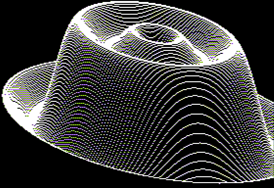

# Atari, er, Applesoft Hat 3D



## Applesoft

```Basic
    0 REM Converted from ATARI "Hat"
    1 REM By Michaelangel007
    2 REM X1 -> X
    3 REM XF -> F
    4 REM XI -> I
    5 REM XL -> L
    6 REM XT -> U
    7 REM Y1 -> Y
    8 REM YY -> V
    9 REM ZS -> S
    10 REM 2.25 * 2.25 -> 5.0625
    100 REM ARCHIMEDES SPIRAL
    110 REM
    120 REM ANALOG MAGAZINE
    130 REM
    140 HGR:POKE 49234,0:REM $C052
    150 F=4.71238905/144
    160 FOR Z=-64 TO 64
    170   S=Z*Z*5.0625
    180   L=INT(SQR(20736-S)+0.5)
    190   FOR I=-L TO L
    200     U=SQR(I*I+S)*F
    210     V=(SIN(U)+SIN(U*3)*0.4)*56
    220     X=I+Z+160:Y=90-V+Z
    222     IF X>279 THEN GOTO 250
    224     IF Y>191 THEN GOTO 250
    230     HCOLOR=3:HPLOT X,Y
    240     HCOLOR=0:HPLOT X,Y+1 TO X,191
    250   NEXT:NEXT
```

### Javascript

* [Javascript (HTML Preview](http://htmlpreview.github.io/?https://raw.githubusercontent.com/Michaelangel007/appl2_hat3d/js/hat3d.html)
* [Javascript (Raw Git Preview](https://cdn.rawgit.com/Michaelangel007/apple2_hat3d/js/hat3d.html)

```Javascript
    function hat( color, isSolid )
    {
        var f = 4.71238905 / 144;
        var i, z;
        var s, h;
        var u, v;
        var x, y;
        var clear = [255-color[0], 255-color[1], 255-color[2], 255];

        for( z = -64; z <= 64; z++ )
        {
            s = z*z*5.0625;
            h = (Math.sqrt( 20736-s ) + 0.5) | 0;

            for( i = -h; i <= h; i += 1 )
            {
                u = Math.sqrt( i*i + s ) * f;
                v = (Math.sin( u ) + Math.sin( u*3 ) * 0.4) * 56;
                x = i + z + 160;
                y = 90 - v + z;

                if ((x < canvas_w) && (y < canvas_h))
                    putpixel( x|0, y|0, color )

                if( isSolid )
                    canvas_vline( x|0, y+1|0, undefined, clear );
            }
        }
    }
```

## Original Atari BASIC

```
Original Atari Basic Source

100 REM ARCHIMEDES SPIRAL
110 REM 
120 REM ANALOG MAGAZINE
130 REM 
140 GRAPHICS 8+16:SETCOLOR 2,0,0
150 XP=144:XR=4.71238905:XF=XR/XP
160 FOR ZI=-64 TO 64
170 ZT=ZI*2.25:ZS=ZT*ZT
180 XL=INT(SQR(20736-ZS)+0.5)
190 FOR XI=0-XL TO XL
200 XT=SQR(XI*XI+ZS)*XF
210 YY=(SIN(XT)+SIN(XT*3)*0.4)*56
220 X1=XI+ZI+160:Y1=90-YY+ZI
230 TRAP 250:COLOR 1:PLOT X1,Y1
240 COLOR 0:PLOT X1,Y1+1:DRAWTO X1,191
250 NEXT XI:NEXT ZI
260 GOTO 260
```

# Original Atari Description

* http://j-b.livejournal.com/419883.html

